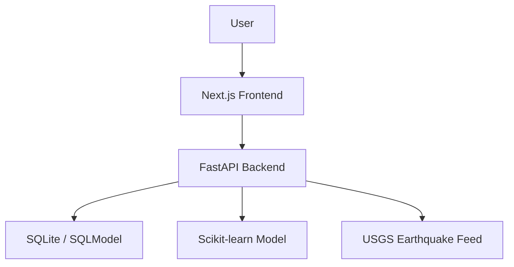

# DisasterAware

DisasterAware is a full-stack disaster intelligence platform built to combine live hazard monitoring, machine learning-based risk assessment, and preparedness guidance in a single web application.

The project focuses on three practical questions:

1. What hazards are active right now?
2. Which cities are at higher risk?
3. What actions should follow from that risk signal?

## Overview

DisasterAware combines a `Next.js` frontend with a `FastAPI` backend and an ML pipeline trained on historical and engineered risk features. The application provides a clean public interface for:

- city-level disaster risk assessment
- live seismic monitoring
- historical incident and prediction records
- model metrics and explainability
- preparedness guidance for major hazard categories

## Key Features

- `Risk Assessment Workflow`
  Submit a city, month, disaster type, and severity to receive a risk level, confidence score, estimated impact, and recommended actions.

- `Live Alerts Console`
  View real-time earthquake activity through a backend USGS proxy and review stored incident history in one operational view.

- `Model Diagnostics`
  Inspect evaluation metrics, feature importance, runtime health, and data-source metadata from the trained model.

- `Preparedness Guidance`
  Present hazard-specific preparedness recommendations in a user-facing format instead of returning only a raw prediction.

## Architecture



## Tech Stack

### Frontend

- Next.js 15
- React 19
- Tailwind CSS
- React Leaflet
- React Icons

### Backend

- FastAPI
- Uvicorn
- SQLModel
- SQLite
- Pandas
- NumPy
- Scikit-learn
- XGBoost
- SHAP

## Repository Structure

```text
backend/
  ml_model/
  routers/
  tests/
  main.py
  seed.py

frontend/
  app/
  public/
  package.json

render.yaml
docker-compose.yml
```

## Local Development

### Backend

```bash
cd backend
venv\Scripts\activate
uvicorn main:app --reload --port 8000
```

### Frontend

```bash
cd frontend
npm install
npm run dev
```

Local URLs:

- Frontend: `http://localhost:3001`
- Backend: `http://localhost:8000`

## Environment Variables

### Frontend

Required:

- `NEXT_PUBLIC_API_URL`

Optional:

- `IPINFO_TOKEN`
- `NEXT_PUBLIC_OPENWEATHER_API_KEY`

### Backend

Required:

- `CORS_ALLOWED_ORIGINS`

Example files are included:

- `frontend/.env.example`
- `backend/.env.example`

## Deployment

The clean free deployment path for this repository is `Vercel` with two separate projects connected to the same GitHub repository:

- `frontend` as a Next.js project
- `backend` as a Python/FastAPI project

### Vercel setup

1. Import the repository into Vercel twice.
2. For the frontend project, set the Root Directory to `frontend`.
3. For the backend project, set the Root Directory to `backend`.
4. Add the following environment variables:

Frontend project:

- `NEXT_PUBLIC_API_URL=https://your-backend-project.vercel.app`

Backend project:

- `CORS_ALLOWED_ORIGINS=https://your-frontend-project.vercel.app`

### Vercel notes

- The backend uses FastAPI and is compatible with Vercel's Python runtime.
- `backend/app.py` is included as the Vercel FastAPI entrypoint while `backend/main.py` remains the local Uvicorn entrypoint.
- SQLite history data is ephemeral on serverless hosting. Prediction history and seeded records can reset between cold starts or redeploys.
- The trained ML artifacts are committed so the API can serve predictions without a retraining step during deployment.

## API Surface

Representative backend routes:

- `GET /status/`
- `POST /api/predict/`
- `GET /api/model-info/`
- `GET /api/city-risks/`
- `GET /api/history/`
- `GET /api/usgs-proxy/`

## Model Pipeline

The ML layer is designed as a risk estimation system rather than an authoritative forecasting engine.

The current pipeline:

- trains on city, seasonal, geospatial, and demographic features
- exposes evaluation metrics and feature importance
- compares the main model against simple baselines
- stores model artifacts for API inference

To regenerate the training artifacts:

```bash
python backend/ml_model/prepare_data.py
python backend/ml_model/train_model.py
```

This refreshes:

- `backend/ml_model/disaster_model.pkl`
- `backend/ml_model/label_encoder.pkl`
- `backend/ml_model/feature_importance.json`
- `backend/ml_model/model_metrics.json`

## Notes

- Historical starter data is seeded through `backend/seed.py`.
- The seed process is idempotent and avoids duplicate inserts on repeated deploys.
- The backend uses a USGS proxy so the frontend does not depend on direct browser-side third-party requests.

## License

No license file is currently included in this repository.
