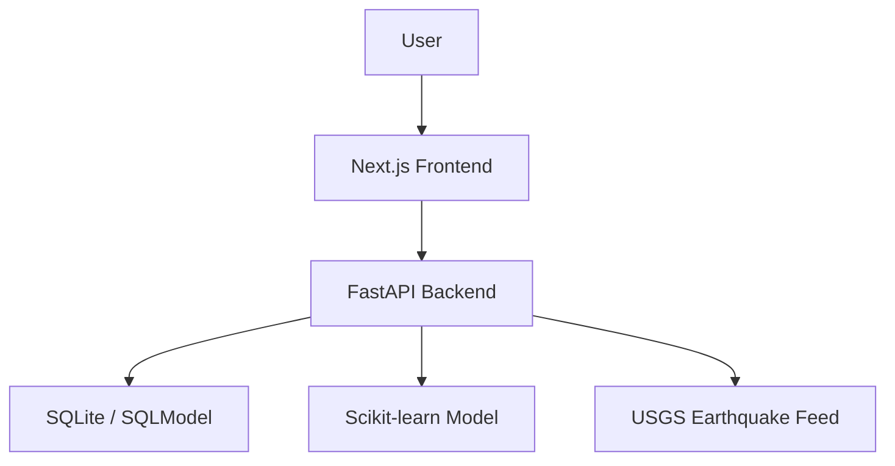

# DisasterAware

DisasterAware is a full-stack disaster intelligence platform for monitoring active hazards, estimating city-level disaster risk, and translating model output into practical preparedness guidance.

## Live Demo

- Production application: [https://disaster-aware.vercel.app](https://disaster-aware.vercel.app)

## Overview

DisasterAware combines a `Next.js` frontend, a `FastAPI` backend, and a machine learning pipeline to support three core workflows:

1. monitor live hazard activity
2. estimate relative disaster risk for supported cities
3. surface recommended actions and readiness context

The platform is designed as a decision-support product rather than a static dashboard. It brings together live seismic data, historical event records, model metrics, and preparedness content in a single public interface.

## Core Capabilities

- `Risk assessment workflow`
  Users can submit a city, month, disaster type, and severity to receive a risk level, confidence score, impact estimate, and recommended actions.

- `Live alerts console`
  The application proxies live USGS earthquake activity through the backend and presents it alongside stored incident history.

- `Model diagnostics`
  The product exposes evaluation metrics, feature importance, runtime health, and model metadata directly in the UI.

- `Preparedness guidance`
  Prediction results are paired with hazard-specific follow-up actions so the output is operationally useful.

## Architecture



## Tech Stack

### Frontend

- Next.js 15
- React 19
- Tailwind CSS
- React Leaflet
- React Icons

### Backend

- FastAPI
- SQLModel
- SQLite
- Pandas
- NumPy
- Scikit-learn
- SHAP for offline analysis

## Product Surfaces

- `Home` for system status, metrics, and platform overview
- `Prediction` for structured disaster risk assessment
- `Alerts` for live seismic monitoring and historical event review
- `Model` for metrics, explainability, and backend health
- `Preparedness` for hazard-specific readiness guidance

## Repository Structure

```text
backend/
  ml_model/
  routers/
  tests/
  app.py
  main.py
  seed.py

frontend/
  app/
  public/
  package.json

docker-compose.yml
render.yaml
```

## Local Development

### Backend

```bash
cd backend
venv\Scripts\activate
pip install -r requirements.txt
uvicorn main:app --reload --port 8000
```

### Frontend

```bash
cd frontend
npm install
npm run dev
```

Local URLs:

- Frontend: `http://localhost:3001`
- Backend: `http://localhost:8000`

## Environment Variables

### Frontend

Required:

- `NEXT_PUBLIC_API_URL`

Optional:

- `IPINFO_TOKEN`
- `NEXT_PUBLIC_OPENWEATHER_API_KEY`

### Backend

Required:

- `CORS_ALLOWED_ORIGINS`

Example files:

- `frontend/.env.example`
- `backend/.env.example`

## Deployment

The project is deployed on `Vercel` as two projects connected to the same GitHub repository:

- `frontend` deployed as the public Next.js application
- `backend` deployed as the FastAPI API service

### Vercel configuration

Frontend project:

- Root Directory: `frontend`
- Required env:
  - `NEXT_PUBLIC_API_URL=https://your-backend-project.vercel.app`

Backend project:

- Root Directory: `backend`
- Required env:
  - `CORS_ALLOWED_ORIGINS=https://your-frontend-project.vercel.app`

### Deployment notes

- `backend/app.py` is used as the Vercel FastAPI entrypoint.
- `backend/main.py` remains the local Uvicorn entrypoint.
- SQLite history is ephemeral on serverless hosting and may reset across cold starts or redeploys.
- Model artifacts are committed so inference works without retraining during deployment.

## API Surface

Representative backend routes:

- `GET /status/`
- `POST /api/predict/`
- `GET /api/model-info/`
- `GET /api/city-risks/`
- `GET /api/history/`
- `GET /api/usgs-proxy/`

## Model Notes

The ML pipeline is positioned as a risk estimation system for decision support, not as an authoritative real-world forecasting engine.

The current shipped model:

- uses seasonal, geospatial, demographic, and event-severity features
- exposes evaluation metrics and feature importance
- compares the main model against simpler baselines
- serves inference through the FastAPI backend

To regenerate training artifacts:

```bash
pip install -r backend/requirements-train.txt
python backend/ml_model/prepare_data.py
python backend/ml_model/train_model.py
```

This refreshes:

- `backend/ml_model/disaster_model.pkl`
- `backend/ml_model/label_encoder.pkl`
- `backend/ml_model/feature_importance.json`
- `backend/ml_model/model_metrics.json`

## Notes

- Seed data is initialized through `backend/seed.py`.
- The seed flow is idempotent and avoids duplicate inserts on repeated deploys.
- The backend uses a USGS proxy so the frontend does not rely on direct third-party browser requests.

## License

No license file is currently included in this repository.
