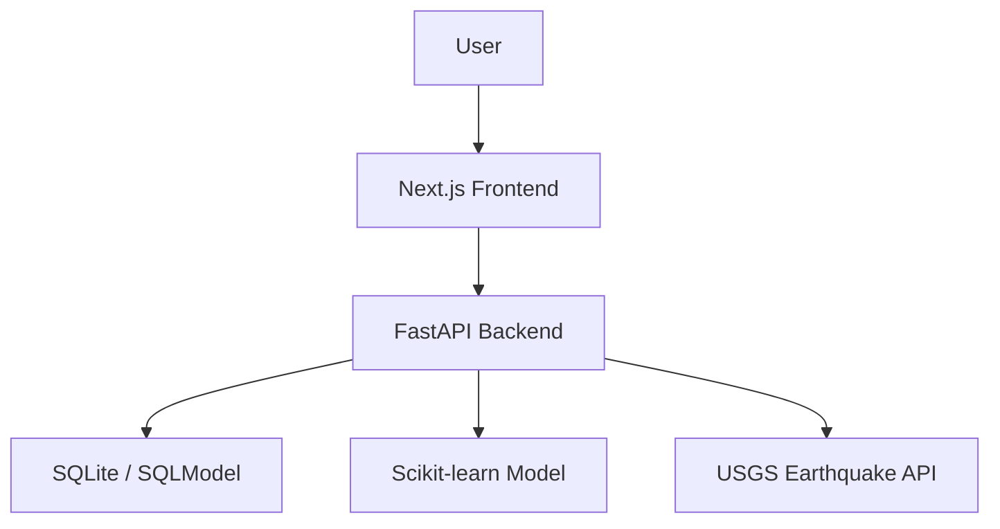

# DisasterAware

DisasterAware is a full-stack disaster intelligence platform that combines live hazard feeds, explainable machine learning, and preparedness workflows into a single product experience.

It is designed to answer three practical questions:

1. What is happening right now?
2. Which cities are at higher risk?
3. What actions should people take next?

## What Makes This Project Strong

- `Next.js 15` frontend built with the App Router and interactive geospatial views
- `FastAPI` backend serving prediction endpoints, health checks, historical data, and third-party feed proxying
- `SQLite + SQLModel` persistence for prediction history and operational records
- `Scikit-learn` model pipeline with exposed metrics and feature-importance output
- `Real-time USGS integration` surfaced through an internal backend proxy instead of direct browser calls

## Core Product Surfaces

### 1. Landing Experience
The homepage is positioned like a production product. It surfaces:

- backend health and model readiness
- live city risk coverage
- feature-importance summaries
- direct paths into prediction, monitoring, and model explainability

### 2. Risk Prediction Workflow
The `/prediction` flow accepts:

- city
- month
- disaster type
- severity

The backend returns:

- risk band
- confidence score
- estimated affected population
- recommended actions
- top contributing risk factors

### 3. Live Alerts Console
The `/alerts` page combines:

- a real-time seismic map powered by the USGS earthquake feed
- a historical incident and prediction registry backed by SQLite
- operational summary statistics that make the data story easier to understand

### 4. Model Intelligence View
The `/model` page exposes:

- evaluation metrics
- runtime health
- training sample counts
- surfaced feature importance

This is especially useful because it demonstrates that the ML layer is not a black box hidden behind a button.

## Architecture



## Tech Stack

### Frontend
- Next.js
- React
- Tailwind CSS
- React Leaflet

### Backend
- FastAPI
- SQLModel
- SQLite
- Pandas
- NumPy
- Scikit-learn
- Joblib

## Local Setup

### Backend
```bash
cd backend
venv\Scripts\activate
uvicorn main:app --reload --port 8000
```

### Frontend
```bash
cd frontend
npm install
npm run dev
```

Frontend runs on `http://localhost:3001` and backend runs on `http://localhost:8000`.

## Deployment

The repo includes a `render.yaml` blueprint for deploying both services on Render.

### Render services
- `disasteraware-backend`
- `disasteraware-frontend`

### Required frontend environment variables
- `NEXT_PUBLIC_API_URL`

### Optional frontend environment variables
- `IPINFO_TOKEN`
- `NEXT_PUBLIC_OPENWEATHER_API_KEY`

### Required backend environment variables
- `CORS_ALLOWED_ORIGINS`

### Notes
- The frontend expects the backend to be deployed first so `NEXT_PUBLIC_API_URL` points to a live API.
- The seed script is idempotent now, so repeated deploys do not duplicate the starter disaster history records.

## Portfolio Talking Points

- Built a full-stack disaster intelligence platform using Next.js and FastAPI to combine live hazard monitoring with ML-driven risk prediction.
- Productized an ML model by exposing confidence, feature importance, health status, and recommended actions through a user-facing application.
- Integrated third-party live earthquake data via a backend proxy and rendered it on an interactive geospatial dashboard.
- Designed a multi-page experience spanning prediction workflows, alerts, preparedness guidance, and model explainability.

## Good Discussion Angles

### Why FastAPI?
Because the ML and data-processing layer already lives naturally in Python, FastAPI keeps the inference pipeline close to the application layer while still providing strong developer ergonomics and performance.

### Why expose model diagnostics in the UI?
Because decision-support systems are more credible when they communicate confidence, major inputs, and system state instead of returning a single opaque score.

### Why proxy USGS data through the backend?
It keeps the frontend simpler, avoids browser-side integration issues, and creates a clean place to normalize, cache, and evolve third-party data handling.

## Retraining The ML Artifacts

If you update the dataset or want the hardened evaluation pipeline to regenerate trustworthy metrics, run:

```bash
python backend/ml_model/prepare_data.py
python backend/ml_model/train_model.py
```

This refreshes:
- `backend/ml_model/disaster_model.pkl`
- `backend/ml_model/label_encoder.pkl`
- `backend/ml_model/feature_importance.json`
- `backend/ml_model/model_metrics.json`

The current training pipeline also:
- removes `death_log` from training features to reduce label leakage
- collapses repeated USGS earthquake rows into a cleaner city-month signal
- compares the ensemble against logistic-regression and dummy baselines
- saves cross-validation summaries alongside holdout metrics
